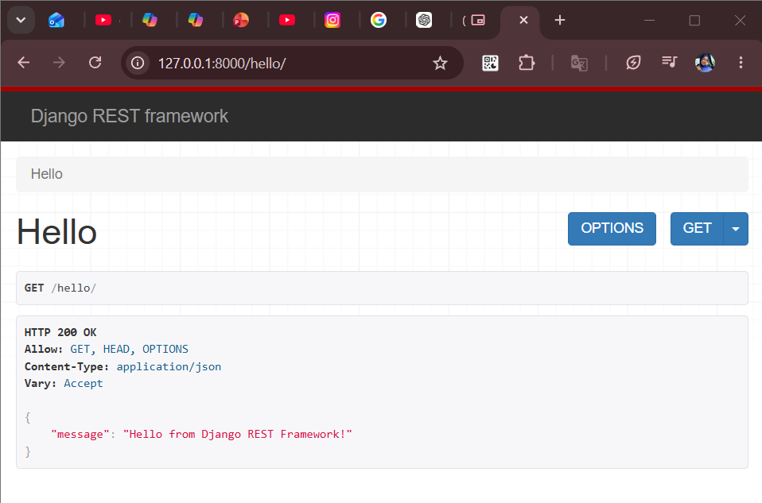

# Week 02 Internship Report

## Overview

During Week 2, I focused on backend development using Django and Django REST Framework (DRF). The objective was to build a simple backend application that supports user registration, user authentication, and API endpoints.

---

## Technologies Used

- Python
- Django
- Django REST Framework (DRF)
- SQLite Database

---

## Tasks Completed

### Django Fundamentals
- Explored Django project structure
- Worked with URL routing and views
- Configured Django settings
- Used Django Admin Panel

### Django REST Framework
- Installed and configured DRF
- Built API endpoints
- Returned JSON responses

### User Registration System
- Created a registration endpoint
- Validated user data
- Stored users in the database

### User Authentication System
- Implemented login functionality
- Authenticated users using Django's authentication system

---

## Implemented API Endpoints

| Endpoint | Method | Purpose |
|-----------|----------|----------|
| /hello/ | GET | Test API |
| /register/ | POST | User Registration |
| /login/ | POST | User Authentication |

---

## Testing and Verification

The APIs were tested using Django REST Framework's Browsable API interface. User creation was verified through the Django Administration Panel, confirming successful database integration.

---

## Screenshots

### Figure 1: Hello API Endpoint

This screenshot demonstrates the successful operation of the Django REST Framework test endpoint (/hello/), returning a JSON response.

---

### Figure 2: User Registration Request

Testing the user registration endpoint by submitting username and password data through the Django REST Framework Browsable API.

---

### Figure 3: User Registration Success

Successful registration of a new user account through the registration API endpoint.

---

### Figure 4: User Login Endpoint

User authentication endpoint configured to accept login credentials via POST requests.

---

### Figure 5: Django Administration Login Page

Django Administration login interface used to access backend management features.

---

### Figure 6: Django Administration Dashboard

Main Django Administration dashboard displaying available models and management options.

---

### Figure 7: User Verification in Database

Verification that the user created through the registration API was successfully stored in the database and appears in the Django Administration panel.

---

## Conclusion

Successfully built a Django backend application with REST API endpoints, user registration, user authentication, and database integration using Django REST Framework.