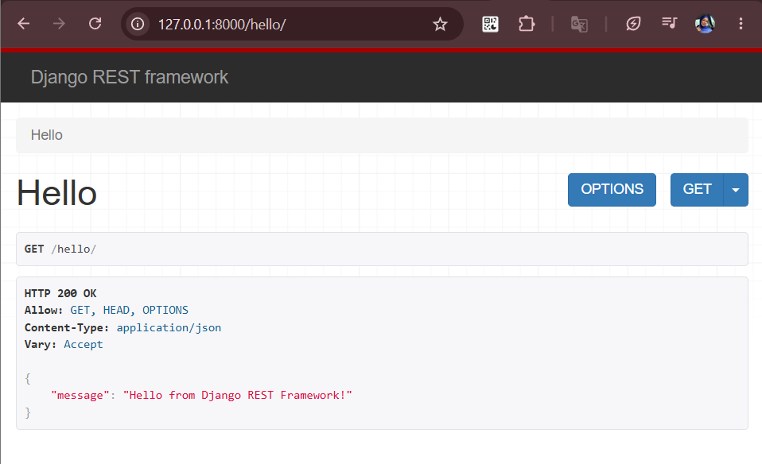
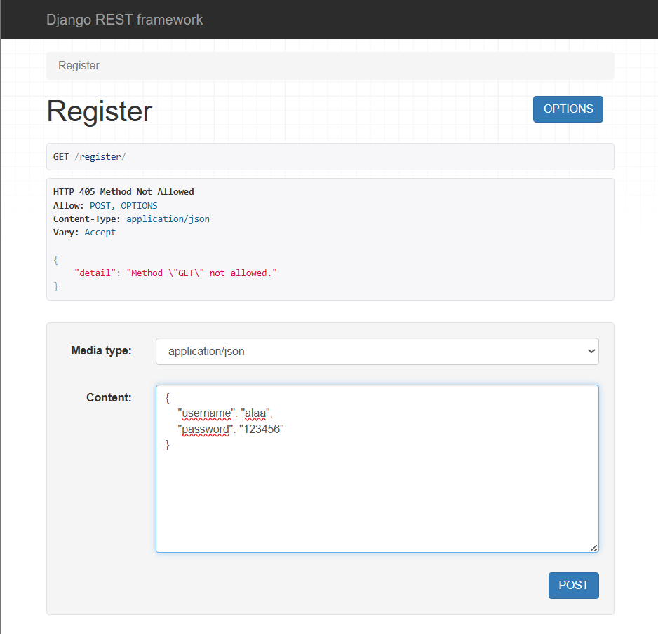
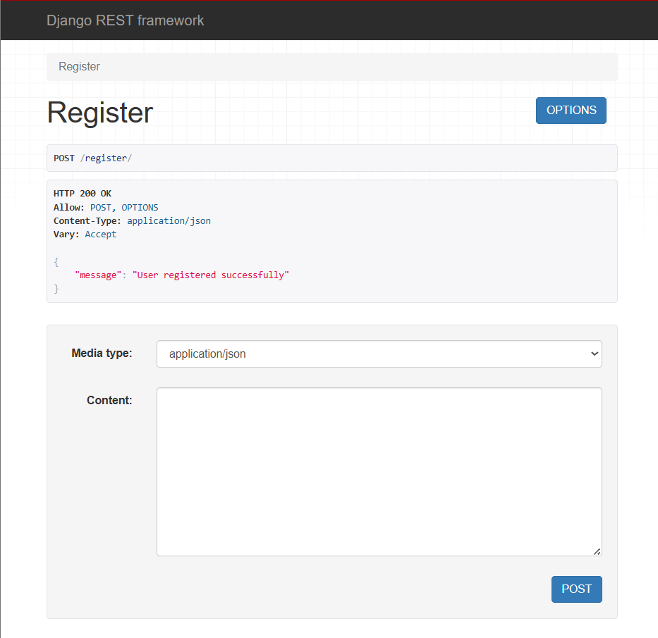
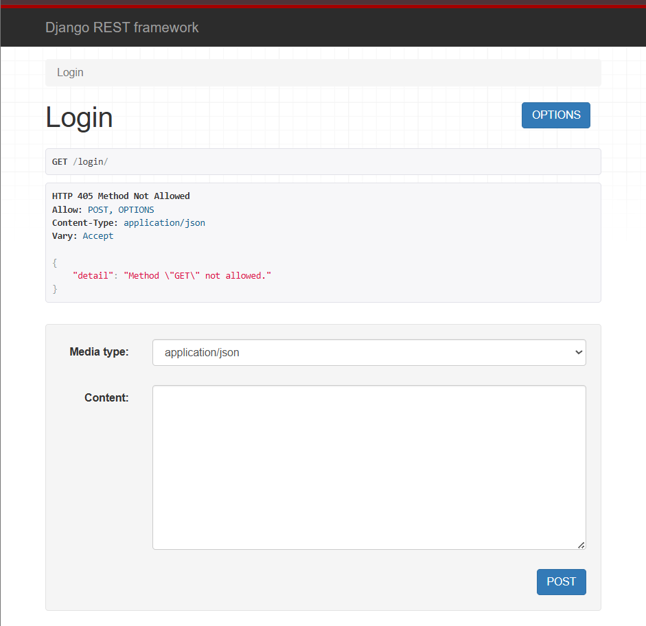
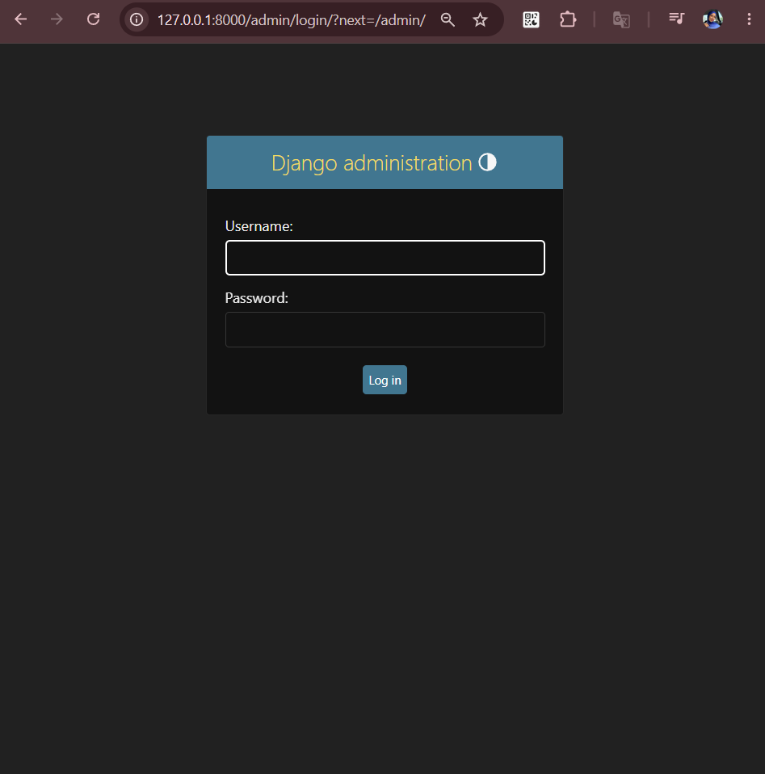
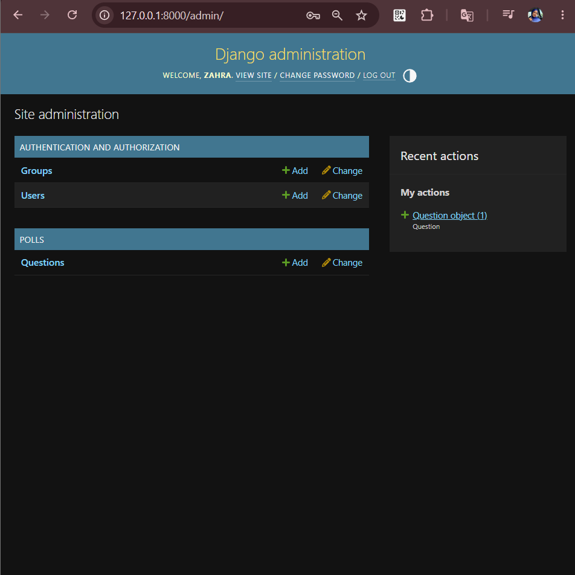
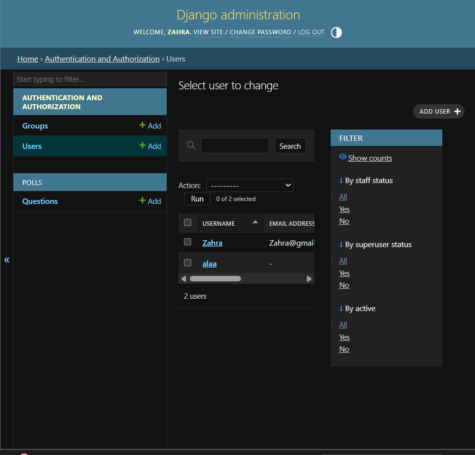

# Week 02 Internship Report

## Overview

During Week 2, I focused on backend development using Django and Django REST Framework (DRF). The objective was to build a simple backend application that supports user registration, user authentication, and API endpoints.

---

## Technologies Used

- Python
- Django
- Django REST Framework (DRF)
- SQLite Database

---

## Tasks Completed

### Django Fundamentals
- Explored Django project structure
- Worked with URL routing and views
- Configured Django settings
- Used Django Admin Panel

### Django REST Framework
- Installed and configured DRF
- Built API endpoints
- Returned JSON responses

### User Registration System
- Created a registration endpoint
- Validated user data
- Stored users in the database

### User Authentication System
- Implemented login functionality
- Authenticated users using Django's authentication system

---

## Implemented API Endpoints

| Endpoint | Method | Purpose |
|----------|--------|------------------|
| /hello/ | GET | Test API |
| /register/ | POST | User Registration |
| /login/ | POST | User Authentication |

---

## Testing and Verification

The APIs were tested using Django REST Framework's Browsable API interface. User creation was verified through the Django Administration Panel, confirming successful database integration.

---

## Screenshots

Throughout the implementation and testing phase, comprehensive screenshots were captured to document the functionality of the Django backend project. These screenshots provide visual evidence of the successful development of all API endpoints and database integration features.

The screenshots cover the following aspects:

- **Hello API Endpoint Response** – Demonstration of the test endpoint returning a successful JSON response
- **User Registration Request** – API testing through the Django REST Framework Browsable API interface
- **Successful User Registration** – Confirmation of user account creation through the registration endpoint
- **User Login Endpoint** – Display of the authentication endpoint configuration
- **Django Administration Login Page** – Backend management interface access
- **Django Administration Dashboard** – Overview of available models and management features
- **User Verification in Database** – Confirmation that registered users are properly stored in the database

### Detailed Screenshots

**Figure 1: Hello API Endpoint Response**

This screenshot demonstrates the test `/hello/` endpoint returning a successful JSON response through the Django REST Framework Browsable API interface, confirming proper API configuration and response formatting.

---

**Figure 2: User Registration Request**

This screenshot shows the registration endpoint form in the Django REST Framework Browsable API, displaying the interface for submitting user registration requests with required fields for account creation.

---

**Figure 3: Successful User Registration**

This screenshot confirms the successful creation of a new user account through the registration endpoint, displaying the API response that validates successful user data processing and database storage.

---

**Figure 4: User Login Endpoint**

This screenshot presents the login endpoint interface, demonstrating the authentication system's availability and proper configuration within the Django REST Framework Browsable API.

---

**Figure 5: Django Administration Login Page**

This screenshot displays the Django Administration panel login page, providing access to the backend management interface where user accounts and database records can be verified and managed.

---

**Figure 6: Django Administration Dashboard**

This screenshot shows the Django Administration dashboard overview, displaying the available models and management features, confirming proper Django setup and database integration.

---

**Figure 7: User Verification in Database**

This screenshot provides confirmation that registered users are properly stored in the database, showing the user list in the Django Administration panel with verified user account records.

---

## Conclusion

Successfully built a Django backend application with REST API endpoints, user registration, user authentication, and database integration using Django REST Framework.